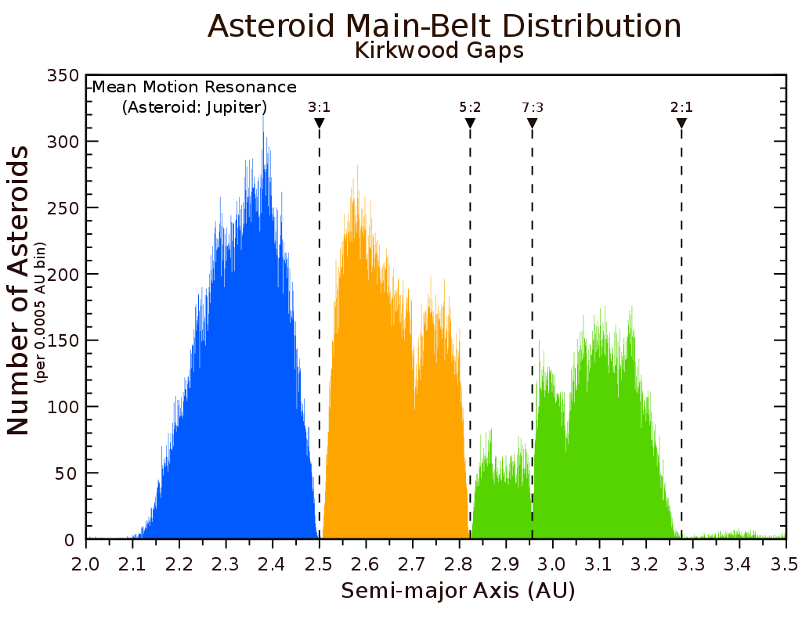

[Click here to see the pdf](..\files\Project_3.pdf)
## Introduction
This is my class project of Introduction to Computational Physics with Yinan Chen in which we simulate the Kirkwood gaps in asteroids belt.

The Kirkwood gaps which represents the absence of asteroids at certain semi-majors(see Figure). we will introduce some observed results of these gaps, as well as the theoretical method and approximations we conduct in our simulation. Furthermore, we
will illustrate the symplectic algorithm we conduct in order to make the simulation more accurate. Finally we will show various results of our simulation and compare them to the observed values.

Our momention equation are cited from [Liu](http://www.u.arizona.edu/~dpsaltis/Phys305/liuetal.pdf) et. al. from University of Arizona. Thanks for they great works which inspires us much. We got more precise and reasonable result by employ the works of Yoshida([Haruo Yoshida](https://www.sciencedirect.com/science/article/abs/pii/0375960190900923)).

